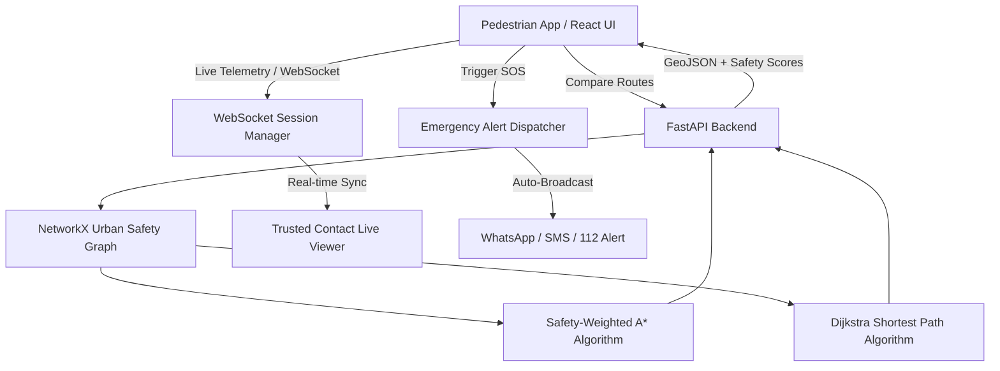

# 🛡️ GuardianPath — Tactical Night-Safety & Safety-Weighted Routing

[](https://fastapi.tiangolo.com)
[](https://react.dev)
[](https://vitejs.dev)
[](https://networkx.org)
[](https://leafletjs.com)

**GuardianPath** is an urban night-safety and navigation system built with **React (Vite)** and **Python (FastAPI)**. Unlike conventional mapping applications that solely optimize for speed and distance—frequently routing pedestrians through pitch-black alleys and unmonitored blind spots—GuardianPath calculates **safety-weighted routes** based on real physical safety attributes paired with proactive discreet deterrents and live companion escort tools.

---

## 🌟 Key Features

### 1. 📐 Mathematical Pure-Data Safety Routing
- **Fastest Direct Route**: Dijkstra-computed shortest physical distance (reveals dark corridors, narrow alleys, and unmonitored cuts).
- **Guardian Safe Route**: Safety-weighted $A^*$ algorithm factoring in physical edge attributes:
  - Street lighting indices ($S_L$)
  - CCTV surveillance coverage density ($S_C$)
  - Proximity buffers to verified 24/7 Safe Havens ($S_H$)
  - Crowdsourced real-time hazard severity ($I$)
- **Mathematical Safety Formula**:
  $$\text{Safety Score} = 100 \times \frac{w_L \cdot S_L + w_C \cdot S_C + w_H \cdot S_H}{w_L + w_C + w_H + w_I \cdot I}$$

### 2. 🚶 Live Companion Escort & Dead-Man's Switch
- Real-time turn-by-turn guidance tracking approaching safe havens (e.g. *Apollo 24/7 Pharmacy ~35m*).
- **Dead-Man's Switch**: Periodic countdown with 1-tap **"I'M SAFE"** check-in reset.
- Automatic emergency escalation if the timer expires without user response.
- Integrated GPS Route Simulator for interactive live walk testing.

### 3. 🚨 1-Tap Emergency SOS & Instant Family Alerting
- Instant 1-tap broadcast to emergency contacts (**Mummy**, **Bhai**) and **National Emergency 112 / Women Helpline 1091**.
- Automatically generates live Google Maps GPS tracking link with timestamp and triggers direct WhatsApp / SMS transmission.
- Tactical hardware siren synthesizer and strobe flasher.

### 4. 🗣️ Authentic Voice Deterrent (Speakerphone Simulation)
- Studio-quality pre-rendered voice clips simulating realistic incoming calls from trusted contacts (*Mummy*, *Police PCR Cruiser*, *Cab Driver*, *Brother*).
- On-screen subtitles displayed in clear English.
- Automated sequential dialogue playback with natural conversational pauses.

### 5. 🧮 Stealth Camouflage Disguise
- Fully functional standard calculator overlay.
- Entering secret emergency PIN (`112=`, `100=`, `1091=`, or `911=`) covertly triggers a silent emergency alert in the background.

### 6. 📱 100% Responsive Adaptive Layout
- **Fullscreen / Desktop View**: Complete multi-card dashboard with side-by-side metric comparisons, safe haven lists, and live telemetry.
- **Mobile Glance View**: Compact tactical bottom sheet with zero-scroll access to destination picker, route switcher, and escort trigger.

---

## 🏗️ System Architecture



---

## 🚀 Quickstart & Local Setup

### Prerequisites
- Python 3.9+
- Node.js 18+ and npm

### 1. Backend Setup
```bash
cd backend
python -m venv venv
source venv/bin/activate
pip install -r requirements.txt
python run.py
```
- API Server: `http://localhost:8000`
- Interactive API Docs (Swagger): `http://localhost:8000/docs`

### 2. Frontend Setup
```bash
cd frontend
npm install
npm run dev
```
- Web Application: `http://localhost:5173`

---

## 📁 Repository Structure

```
GuardianPath/
├── backend/
│   ├── app/
│   │   ├── main.py                     # FastAPI application & router mounting
│   │   ├── config.py                   # Safety weights & proximity buffers
│   │   ├── models/                     # Pydantic schemas (routing, emergency, incidents)
│   │   ├── services/                   # Graph algorithms, NetworkX routing, WebSockets
│   │   └── routers/                    # API endpoints (routing, emergency, TTS, incidents)
│   ├── data/
│   │   └── urban_safety_nodes.json     # Urban graph data & 24/7 safe havens
│   ├── generate_audio_assets.py        # Voice deterrent audio generator
│   ├── test_backend.py                 # Comprehensive backend test suite
│   └── requirements.txt
│
├── frontend/
│   ├── index.html                      # HTML5 entrypoint & Google fonts
│   ├── vite.config.js                  # Vite configuration & proxy settings
│   ├── package.json
│   └── src/
│       ├── App.jsx                     # Main layout orchestrator
│       ├── components/
│       │   ├── map/                    # Leaflet tactical dark-mode map
│       │   ├── navigation/             # Route comparison cards & turn guidance
│       │   ├── companion/              # Dead-Man switch & Live escort HUD
│       │   ├── audio/                  # Ambient acoustic threat visualizer
│       │   ├── discreet/               # Fake call modal, calculator disguise, panic beacon
│       │   └── layout/                 # Tactical header HUD & bottom dock
│       ├── context/                    # TripContext & SafetyContext
│       └── styles/                     # Tactical cyber-night responsive CSS
│
├── .gitignore
└── README.md
```

---

## 🧪 Testing

To run the automated backend test suite:
```bash
cd backend
python test_backend.py
```

To validate the frontend production build:
```bash
cd frontend
npm run build
```

---

## 📄 License
MIT License. Created for proactive pedestrian night-safety.
